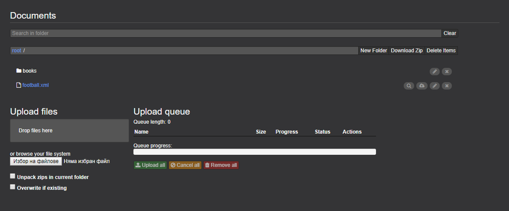

# Documents Perspective
Eclipse Dirigible ™ is a Cloud Development Platform providing development tools and runtime environment. 
It contains the option for documents perspective.
The **Documents perspective** is the place where the user manages the binary artifacts such as pictures, spreadsheets, PDF files, etc.
It enables him/her to upload, overwrite, download, delete and search for artifacts.
At the moment the view is called Documents.

